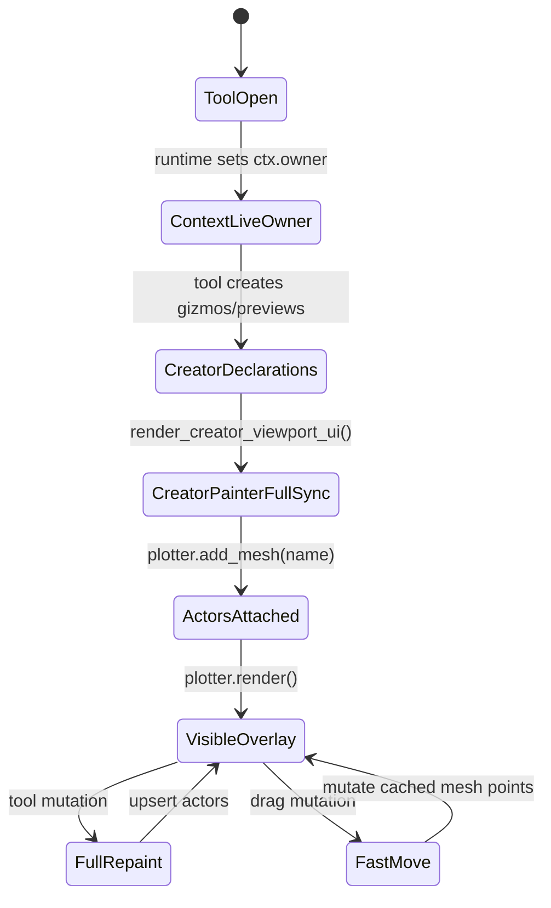
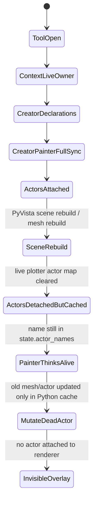
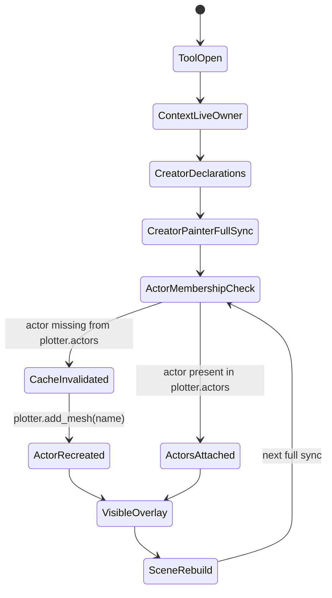

# Pass 252 — Overlay state-machine repair after Creator API migration

## Symptom

Plan Tracer 2D and Texture Projection no longer showed their viewport overlays after the API cleanup / Projected Drawing decoupling. The issue reproduced across two tools, so the failure was treated as a shared overlay state-machine problem rather than a Plan Tracer-only bug.

## Comparison against v73 working path

### v73 working state machine

In v73, the generic Creator UI painter rebuilt or updated viewport actors from the tool declarations and the actors stayed present in the PyVista actor map.

### v83 broken state machine

The important broken state is **ActorsDetachedButCached**: `ToolCoreDiagScenePainter` held a valid Python cache, but the live PyVista plotter no longer had the actor. Because the upsert path only checked `state.actor_names`, it skipped `plotter.add_mesh()` and updated a dead actor reference.

This explains why both Plan Tracer and Texture Projection broke: both use `render_creator_viewport_ui()` → `ToolCoreDiagScenePainter` for Creator API gizmos/previews.

### v84 repaired state machine

The fix makes actor membership explicit. A cached actor is considered valid only if it is still present in the live plotter actor map. Otherwise, the painter forgets the stale cache entry and recreates the actor.

## Code changes

- Added `ToolCoreDiagScenePainter._plotter_has_actor()`.
- Added `ToolCoreDiagScenePainter._forget_actor_cache()`.
- Hardened `_upsert_points_actor()`.
- Hardened `_upsert_mesh_actor()`.
- Hardened label actor recreation.

## Why this is safer than rolling back the API migration

The v74+ migration of `tool_core.projected_drawing` away from direct application imports was not reverted. The missing piece was the lifecycle of the older Creator UI painter, which is still used by tools that have not fully moved to Projected Drawing 2D. This patch fixes the shared runtime invariant instead of restoring forbidden dependencies.

## Regression tests

Added `tests/test_pass252_overlay_state_machine_repair.py`:

- `test_pass252_creator_ui_recreates_missing_handle_actor_after_scene_rebuild`
- `test_pass252_diag_painter_recreates_missing_line_actor_after_scene_rebuild`

These tests simulate a PyVista scene rebuild by clearing `plotter.actors` while keeping the painter state alive, then verify that the next render recreates the missing actors.
